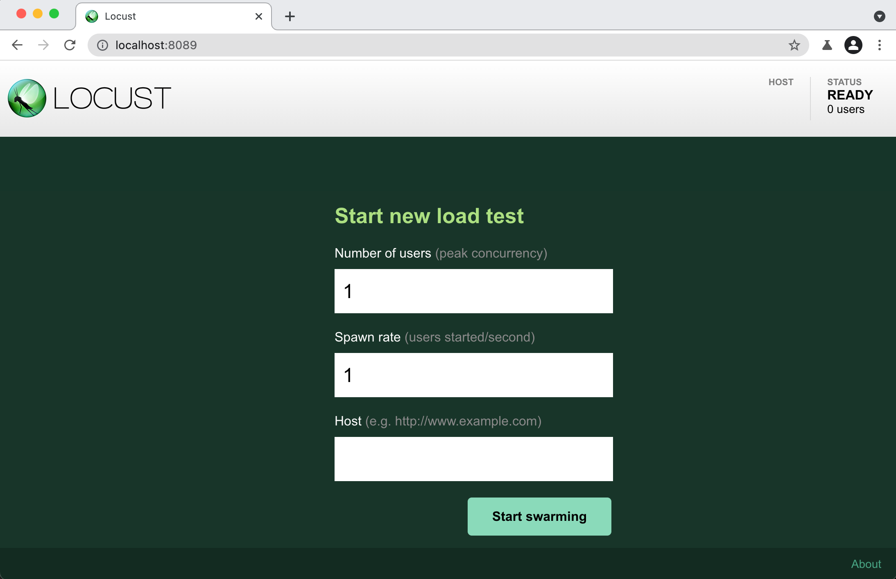

# Locust 로 웹서버 로드 테스트 

## 시작하기 
Local machine 또는 클라우드 virtual machine 을 이용하여 웹서버의 로드 테스트
1. Locust [설치](https://docs.locust.io/en/stable/installation.html)
1. locustfile.py 가 있는 폴더에서 locust 실행 
    ```bash
    $ locust
    ```
1. 웹 UI 열기 http://localhost:8089 또는 클라우드 서버의 IP 
1. number of users, Spawn rate, Host 입력 후 Start swarming 클릭 

1. 모니터링 


